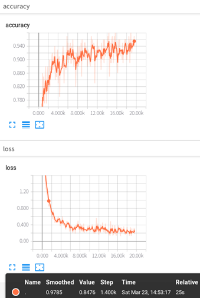
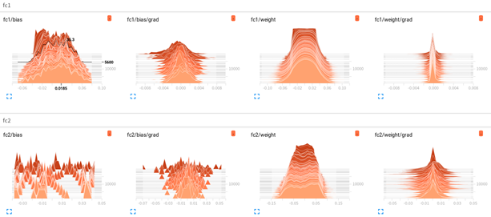

# chapter6-Training_process_visualization-note

I wasted a lot of time on docker. u know，I wanted to use Crayon to do visualization on docker, but my server couldn't ping the Internet. I tried over again and again and again，but I've failed, um....I don't like it actually。

So I took the tensorboard seriously and visualized it during the training process. I mean，the official documentation，um.....the code that I've visualized the training process , even each line were annotated, u know, the visualization of the training process for our academic research. Is very important right ? especially in the CV direction

